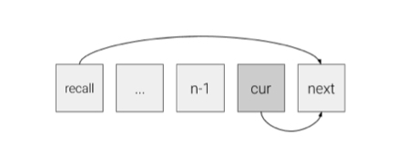
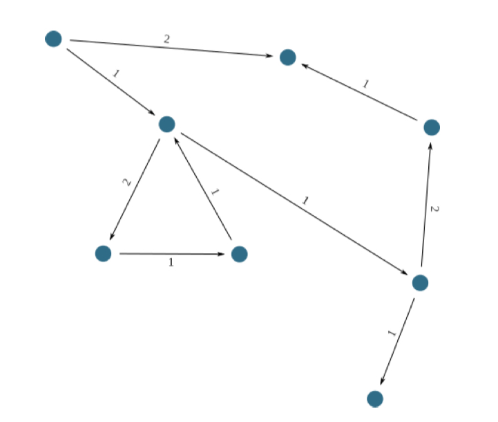

# Arweave Lightpaper 中文版本

**作者**：Samuel Williams & William Jones       

**翻译**：曾汨 & Sauvignon & 0dayZh

## 目录

- [摘要](#%e6%91%98%e8%a6%81)
- [1. 引言](#1-%e5%bc%95%e8%a8%80)
- [2. 背景](#2-%e8%83%8c%e6%99%af)
- [3. 动机](#3-%e5%8a%a8%e6%9c%ba)
- [4. 技术](#4-%e6%8a%80%e6%9c%af)
  - [4.1 Blockweave](#41-blockweave)
  - [4.2 访问证明](#42-%e8%ae%bf%e9%97%ae%e8%af%81%e6%98%8e)
  - [4.3 Wildfire](#43-wild%ef%ac%81re)
  - [4.4 区块影子（Blockshadows）](#44-%e5%8c%ba%e5%9d%97%e5%bd%b1%e5%ad%90blockshadows)
  - [4.5 民主的内容政策](#45-%e6%b0%91%e4%b8%bb%e7%9a%84%e5%86%85%e5%ae%b9%e6%94%bf%e7%ad%96)
  - [4.6 讨论](#46-%e8%ae%a8%e8%ae%ba)
    - [4.6.1 存储池](#461-%e5%ad%98%e5%82%a8%e6%b1%a0)
- [5.构建应用](#5%e6%9e%84%e5%bb%ba%e5%ba%94%e7%94%a8)
  - [5.1 客户端-服务器架构](#51-%e5%ae%a2%e6%88%b7%e7%ab%af-%e6%9c%8d%e5%8a%a1%e5%99%a8%e6%9e%b6%e6%9e%84)
  - [5.2 无服务器架构](#52-%e6%97%a0%e6%9c%8d%e5%8a%a1%e5%99%a8%e6%9e%b6%e6%9e%84)
  - [5.3 基于事件的架构](#53-%e5%9f%ba%e4%ba%8e%e4%ba%8b%e4%bb%b6%e7%9a%84%e6%9e%b6%e6%9e%84)
  - [5.4 免信任和可证明的架构](#54-%e5%85%8d%e4%bf%a1%e4%bb%bb%e5%92%8c%e5%8f%af%e8%af%81%e6%98%8e%e7%9a%84%e6%9e%b6%e6%9e%84)
- [6.用例](#6%e7%94%a8%e4%be%8b)
  - [6.1 真实性](#61-%e7%9c%9f%e5%ae%9e%e6%80%a7)
- [7.结论](#7%e7%bb%93%e8%ae%ba)
- [参考资料](#%e5%8f%82%e8%80%83%e8%b5%84%e6%96%99)

## 摘要

当下主流的区块链平台在数据存储方面还存在着一些众所周知的难题。这些难题需要通过在现有平台上集成新的第三方协议才能解决，原因在于链上存储的成本极高以致于不可用。因此，在当前主流的区块链上实现永久性的存储和免费的内容访问就像是无稽之谈。而随着数据存储的需求呈现指数级的增长，我们亟需一种可扩展的去中心化低成本数据存储协议。

在本文中，我们将向你介绍 `Arweave` —— 一种名为 `blockweave` 的新型区块链式结构。它是首次以一种经济合算的方式提供可扩展链上存储的平台。

随着系统中数据存储量的增长，达成共识所需要的哈希数量会减少，从而降低了数据存储的成本。通过该协议现有的 `REST API`，可以非常轻松的在 `Arweave` 上构建去中心化的应用，这也体现了 `Arweave` 对开发者社区的重视，以及他们推动新协议大规模普及的能力。

在本文中，我们还引入了一系列新奇的概念，例如：区块影子 —— 一种灵活的交易区块分发算法，针对当下其它区块链上的 “分片” 技术进行了改进，还有一种自优化的网络拓扑结构，以及一种新型的共识机制 —— 访问证明。

## 1. 引言

在这个信息时代里，我们常常会陷入一种错觉当中 —— 信息随手可得，且永远不会被篡改或者丢失。这根本不切实际 [[7](#7)]。尽管我们已经在互联网上建立了一个庞大的分布式信息传播系统，但一个与之相应的永久性知识存储系统还没有被建立起来。从图书馆和档案馆的熊熊烈火 [[9](#9), [10](#10), [3](#3), [8](#8)]，再到独裁主义国家的书籍焚毁 [[12](#12), [11](#11)]，现代历史上充斥着这样重要信息被破坏和丢失的例子。当我们在网络上查找信息时，必须经过存储着这些数据的中心化服务器的许可。然而，持有这些信息的服务器的所有者们可以随时废除我们的访问权限。同样地，由于在互联网上提供信息需要部署服务器并支付高昂的维护费用，所以当资金难以为继时，网站往往会消失。此外，许多政府正在采取越来越多的措施来审查网络上的政治敏感信息并阻止大众的访问 [[13](#13), [5](#5), [4](#4)]。媒体和新闻机构也好不到哪去，我们曾经有着不可更改的实体复制品（比如报纸），而现在我们只是简单地访问信息然后迅速地抛弃它们。随着时间的推移，媒体机构不断地更新文章内容已经变得司空见惯。虽然这比起以前的系统有诸多优势，尤其是传播关于事件发展情况的实时信息，但这也令重要的背景信息变得模糊甚至丢失。

## 2. 背景

所有的区块链创新都站在巨人的肩膀上，包括比特币本身 —— 它由数据结构、分布式网络和密码学组合而成。我们也在寻求更进一步地去解决现有区块链网络的痛点，即存储问题，并寻找一个提高交易速度的新方法。目前绝大多数区块链技术坚持 “全节点” 必须维护整条区块链的副本，以便其验证未来的交易。虽然默克尔数据结构本身就是一个令人神往的创举，它增加了一层超级无敌的安全层，但我们仍然认为在这一过程中增强一些性能可以减少全节点的同步负担。我们会在第四节中介绍几种解决区块、节点和钱包同步的技术。

当涉及到数据存储时，维护区块链完整的要求也许是现有区块链技术的一个更大的阻碍。以以太坊为例 —— 一台去中心化的世界计算机，消耗它的原生代币来存储数据极为昂贵。`Arweave` 的核心目标就是让永久的、不可篡改的数据存储成为现实，就像在以太坊上实现的那样。然而，高昂的费用让这样的存储变得越来越不切实际。虽然在以太坊上实现这一点并非毫无可能，但由于数据存储数据所需的巨额开支，曾经的尝试犹如痴人说梦。

其它区块链技术一直专注于提升节点间的共识算法，尤其是恒星区块链，以及诸如 `Ark` 和 `Neo` 等一些采用 `dPoS` 算法的区块链。虽然这或许能够提高交易速度，但存储的负担仍然是这些区块链要长期面临的阻碍。通过优先解决存储问题，我们进行了数次性能增强，而这也可以提高交易的吞吐量。

## 3. 动机

我们设计并实现了一个区块链网络，让永久、低成本的存储变为现实。通过将存储访问融入到共识算法中，结合新的交易打包方法以及任意大小的区块，我们创造了一种具备高吞吐量的加密货币，它改进了诸如比特币 [[10](#10)] 和以太坊 [[12](#12)] 等其它加密货币。以前，（互联网上或其它地方的）档案通常被单独的机构或个人保管，这使得它们很容易受到两种主要形式的操纵。第一种是在文件保存的过程中对其进行篡改 [[2](#2)]。第二种则是文件在保存之前就已经被伪造或篡改了 [[1](#1)]。举例来说，很多被认为是苏格拉底的作品，据传为其弟子们的杰作 [[6](#6)]`。Arweave` 同时解决了这两个问题。一旦文件被储存到 `Arweave` 网络上，它就会被以密码学方式和其它每个区块连接起来。这确保了任何改动文件内容的尝试都会被网络所察觉并阻止。通过这种方式，没有人可以更改存储在 Arweave 网络上的信息。`Arweave` 对互联网来说是一个可浏览的姐妹网络，它提供了目前互联网亟需但却缺乏的长期、永久性的数据存储功能。

`Arweave` 系统专门为开发者设计了一个关键组件，开发者通过该组件可以很轻松地构建一个接入网络、创建并使用数据的应用。这些应用是基于与编程语言无关的 REST API 而构建的，它们将充当网络中的节点并监听网络。从去中心化和不可篡改的社交网络到网络论坛和新闻聚合器，这些应用的功能将是灵活多样的。想要在 `Arweave` 网络中保存信息，需要花费少量的代币。这些代币会支付给矿工来维护 `Arweave` 网络，同时阻止垃圾信息的传播。这相较于传统的中心化存储系统而言有着显著的提升。同样地，这让个人能够确保他们所关心的信息可以永久地保存下来。代币的价值会随着网络规模的扩大和文件存储的增加而不断增强，维护 `Arweave` 网络的动机自然也会变得越来越强烈。在这些因素的综合影响下，我们期望 `Arweave` 的代币成为信息时代中富有价值的数字资产，并与大量的重要文件有着密不可分的内在联系。

## 4. 技术

`Arweave` 基于四项核心技术构建而成，它们共同创造出了一条低成本、高吞吐量、永久存储型的新型区块链。这四项创新技术分别是：

* `Blockweave`
* 访问证明（`Proof of Access`）
* `Wildfire`
* 区块影子（`Blockshadows`）

虽然这些技术相互组合，但是在创造一条同时实现快速交易和低成本永久性存储的新型区块链网络的过程中，每一项技术都发挥着关键作用。

### 4.1 Blockweave

大多数区块链都有一个众所周知的性质—— 想要参与验证交易的 “全节点” 们必须存储每一个区块。`Arweave` 却与众不同。

相反，`Arweave` 引入了两个新的概念，使得节点在不存储整条链的前提下仍然可以完成关键的网络功能。第一个概念是区块哈希列表（`block hash list`），它是先前所有区块的哈希值列表。通过区块哈希列表我们可以验证旧的区块并有效地评估潜在的新区块。第二个概念是钱包列表（`wallet list`），它是系统中所有活跃钱包地址的列表。它允许节点在不拥有产生上一笔交易的区块的情况下对新交易进行验证。矿工可以自由下载这些在网络中不断同步的区块哈希列表和钱包列表，所以节点几乎可以立即加入网络中来参与挖矿。

不仅如此，在普通的区块链中，当矿工加入网络时，必须验证从创世区块到当前区块为止的完整区块结构，而 `Arweave` 则使用了一套 “不间断验证” （`ongoing verification`）系统。当矿工加入 `Arweave` 网络时，它们将下载当前区块并从中检索区块哈希列表和钱包列表。而由于这些区块哈希列表和钱包列表已经在之前每个区块的 “不间断验证” 流程中得到了充分验证，所以新矿工可以立即参与挖矿，而无需自行验证整条区块链。当然，任何节点想要验证完整的 `Arweave` 网络也是可以的。通过这种方式，矿工无需再寻找与某一钱包相关的上一笔交易来验证新的交易。相反，矿工只需要验证该交易是否包含钱包所有者的私钥签名即可。为了防止重调（`recall`）区块的伪造攻击，区块哈希列表的哈希值将分发到每一个新区块中。

图1：`blockweave` 数据结构的图示，展示了当前区块和上一个区块以及重调（`recall`）区块之间的联系。

### 4.2 访问证明

Arweave 的共识机制基于访问证明（`PoA`，`Proof of Access`）和工作量证明（`PoW`）。典型的 `PoW` 系统只依赖上一个区块来生成每个连续的区块，而 `PoA` 算法则从之前的区块中随机选择一个区块（即 “重调 ” 区块），然后借助该区块的数据来生成新区块。这与前面介绍的 `blockweave` 数据结构结合起来，矿工无需存储所有的区块（形成一条区块链），但可以存储任意先前的区块，通过 `PoA` 和 `Wildfire` 的激励，形成一条 `blockweave`。而 “重调区块” 的选择是通过计算当前区块的哈希值相对当前区块高度的模数来得出的。

为了生成下一个区块，需要将重调区块中的交易与当前区块中的交易一起进行哈希运算。当某个矿工找到一个合适的哈希值时，他们就会将新区块连同重调区块分发给网络中的其它成员。因此。即使网络中的其它成员没有存储该重调区块，也能独立验证新区块的有效性。

### 4.3 Wildfire

作为一个数据存储系统，`Arweave` 不仅需要能够存储大量的信息，还要为访问这些数据提供一种最为便捷的方式。不仅如此，`Arweave` 系统中非常重要的一部分是数据访问的免费。为了实现此目标，`Arweave` 又增加了一层激励措施，来鼓励矿工免费分享数据。

`Wildfire` 就是一种可以在去中心化网络中解决数据分享问题的系统，它使在网络中快速满足数据访问的请求成为参与挖矿的一个必要条件。`Wildfire` 的工作原理是在每一个节点本地创建一个排名系统，基于节点对网络请求的响应速度和从其它节点那里接收数据的速度来对节点进行排名，并根据这个排名来决定新区块和交易分发到节点的速度。节点之间按照它们的排名顺序来提供服务，表现不佳的节点将会列入全网的黑名单。节点们受到经济上的激励，在彼此的排名中保持良好的排名，于是它们就可以花最多的时间进行有效的挖矿。

这一方式强烈激励了系统中的节点以最友好的方式对待其它节点，同时节点无需为接收数据付出任何成本，即便对于那些可能发出一次性请求的节点也是如此。更进一步来说，它创建了一个网络拓扑结构，以实现最有效的全局分发路由，因为它使得可以在系统中快速转移新数据的连接成为首选。在实践中，`Wildfire` 机制构建了一个网络拓扑结构，映射了互联网的底层物理连接基础，以适应其架构随时间的变化。总而言之，`Wildfire` 系统确保了新区块的快速分发，并以低延迟保持了数据的可用性。

图2：`Wildfire` 系统示意图。每个节点对其它节点进行排序，根据其它节点之前对它的行为的有利程度。

### 4.4 区块影子（Blockshadows）

在传统的区块链系统中，每一个新挖出区块都会被分发到网络中的每一个节点，而不论它们已经存储了多少区块数据。这不仅仅浪费了大量的数据，而且还极大地降低了网络对区块达成共识的速度。因此，`Arweave` 引入了一项新的技术 —— 区块影子（`Blockshadows`），它不仅仅能最大限度地减少对数据的浪费，还能带来更快的出块速度和巨大的交易吞吐量。

区块影子的工作原理是将交易从区块中部分解耦，并且只在节点之间发送一个最小的区块 “影子” ，而非传输整个区块本身，通过区块 “影子” ，节点可以重构出一个完整的区块。这些区块影子具体包含一个钱包列表和区块哈希列表的哈希值，以及一组交易哈希列表，而非区块内的交易。通过这些信息（可能只有几千字节），一个已经拥有区块内所有交易以及一个最新的哈希值和钱包列表的节点可以重构几乎任意大小的完整区块。为了促进这一点，节点也会立即和其它节点分享交易，但只有当他们高度确认网络中的其它节点也拥有同一笔交易时，才会将该笔交易打包进区块。

区块影子的引进创造了一个快速灵活的区块分发系统，它可以使得交易确认的速度和交易在网络中分发的速度一样块，并以一个接近网络分发的速度达成对区块的共识。此外，当网络的使用率变高时，区块影子会确保交易费用不会显著增长。理论上，在带宽为 100mbps 的网络环境中，乐观来看系统的吞吐量可以达到每秒 5000 笔交易。

### 4.5 民主的内容政策

为了支持网络中的个人参与者自由地控制他们存储的内容，并允许网络作为一个整体来民主地拒绝某些受到广泛谴责的内容，`Arweave` 软件提供了一个黑名单系统。每一个节点都（可选地）维护着一个黑名单，其中包含它不想存储的特定数据的哈希值或子字符串，并且永远不会在它的磁盘中写入与之匹配的内容。这些黑名单可以由个人或大家相互协作来创建，也可以从其它来源导入。

在本地层面上，这些黑名单允许节点控制它们自己存储的内容，然而，这些本地的拒绝会引起全网范围内对内容的拒绝。被网络中半数以上节点拒绝的内容不仅仅会被每个独立的节点拒绝，还会被更加广泛的网络整体所拒绝。这创造了一个民主的全网内容拒绝系统，这个系统可以跨越不同的文化和意见合并黑名单，从而形成对广受谴责的内容的一个微小而具体的黑名单。这个近乎普遍的、民主的黑名单保护网络免受外部少数人的审查，与此同时网络仍然可以以一种民主的方式自由地保护自己。

### 4.6 讨论

#### 4.6.1 存储池

针对 `Arweave` 的一个理论上的潜在攻击已经变得异常巨大 —— 矿工可能会联合起来维护 `Arweave` 网络的单一副本，他们都可以通过该副本来检索重调区块。虽然这一行为乍看上去存在问题，但事实并非如此。如果大部分矿工都使用这种 “存储池”，那么其他矿工存储稀有区块的动机就会增加。这是因为，如果 “存储池” 变得无法使用，那么存储了稀有区块的矿工非常有希望在未来该区块成为重调区块时获得奖励。矿工的这种自利行为为网络提供了风险补偿，并且随着潜在的数据丢失（由中心化存储池造成）的可能性增加而增加。

## 5.构建应用

开发者可以通过简单的 `REST API` 来构建基于 `Arweave` 网络的应用 `。REST` 的端点是 `HTTP`，可以直接访问网络，这样任何 `Arweave` 钱包都可以直接读写网络数据。用户只需要通过 `Chrome` 扩展或者集成了 `Arweave` 钱包的本地应用将他们的 `Arweave` 钱包导入到网站就可以从网络中读取数据，或将数据写入到网络中了。以下是几类可以构建在 `Arweave` 网络上的架构。

### 5.1 客户端-服务器架构

传统的 `web` 应用或本地应用通常采用的是客户端-服务器架构。运行在云端的服务器将对 `Arweave` 网络进行适配，通过与一个或多个 `Arweave` 节点进行交互，来代表客户端读取或写入数据。这些服务的类型五花八门，比如作为网站服务于代表访问者的客户端，也可以作为本地的应用程序，执行客户端传递给开发者的请求。而这些服务器则需要支付数量不定的 `AR` 代币，从而确保其可以处理数据写入的请求。尽管如此，在这种架构下从 `Arweave` 网络中读取数据依然是免费的。

对于采用这种架构的应用而言，盈利模式非常简单。开发者需要通过广告、每月订阅服务或用户直接向他们的应用支付包装过的 ”积分“ 来完成价值捕获，而非通过 `AR` 代币来支付存储的成本。已经有许多应用使用了不可篡改的永久性存储。比如用于存储可以抗量子攻击的加密法律文案、身份信息或医疗记录。尽管有些法律需要顾及敏感信息的存储、地理上的界限和被遗忘的权利，但这些问题在一定程度上都可以通过加密和密钥管理来缓解。几种盈利模式可以在 `Arweave` 网络上互相组合，但核心的价值主张始终是永久不变的链上存储。

### 5.2 无服务器架构

应用也可以依赖网络本身（而非服务器）来运行，客户端可以通过一个适配了 `Arweave` 的浏览器来访问应用。由于浏览器的普及和 `web` 技术的广泛应用，对于开发者而言，使用 `HTML/CSS/JS` 来将这些应用存储为标准化的前端 `web` 应用是非常有意义的。然而，如果客户端的本地应用内置了各类编程语言（诸如 `LLVM` 字节码或 `Python` 等脚本语言）的解释器/解析器的话，那么这些应用就可以直接在客户端上直接运行，并且还可能受益于其与 `web` 端应用同等的升级能力。

开发者们能做的可不仅仅是在 `Arweave` 上部署无服务器的应用，这些应用还可以在网络中写入持续性且可证明的状态。由于 `Arweave` 并没有强制开发者使用特定的数据结构，因此开发者可以自由地以最适合他们的格式存储数据。如果最适合应用使用的是高度优化的默克尔结构（和以太坊虚拟机（`EVM`）中一样），也可以在 `Arweave` 网络中轻松实现。当然，如果开发者希望存储更多 `blob` 风格的文本，也是毫不费力的。

无服务器的应用还有一个非常有趣的点 —— 它们可以写入应用自身的数据。举个例子，分层的分布式计算允许在训练神经网络的过程中存储其结果，并与其它神经网络共享它们的结果模型。

### 5.3 基于事件的架构

在 `Twitter` 成立初期，曾经出现过一个蓬勃发展的生态系统，由开发者基于 `“firehost” API` 搭建的一个个小作坊式的应用组成，这些应用向付费用户们源源不断地发送推文。而如今情况已经完全不同了，自从 `Facebook` 从剑桥分析公司（`Cambridge Analytica`）那里收获了惨痛的教训之后，这些为客户提供数据分析服务的 “值得信赖的合作伙伴” 正在被任意地关停。

`Arweave` 是一个去中心化的公共数据网络，因此绝不会审查数据的访问权限以及数据本身 —— 被民主拒绝了的内容除外。这是开发者的福音，他们可以在 `Arweave` 上自由地构建应用，并通过 `REST API` 监听传入的数据。一旦事件被触发，监听器就会触发订阅了这些事件的客户端去调用适当的函数。开发者再也无需担心他们的应用被限制或关闭，因为网络有动力为他们提供可靠的数据源访问。

### 5.4 免信任和可证明的架构

可以通过对应用的架构进行设计，使其非常容易实现信息的存储并保证其防篡改。此外，还可以直接在 `Arweave` 网络中存储可证公平的运行时代码，并由客户端直接解释。通过使用内容的交易 `ID`，客户端可以在进行计算之前验证 `Arweave` 网络的有效负荷，并保证它们所运行的代码是免信任且可证公平的，也就是说，它与其它客户端运行的是同样的代码。这也为免信任型随机数生成器以及其它基于预言机的服务（可能服务于其它区块链网络）带来了有趣的可能性。

## 6.用例

永久性存储有几个应用场景。具体来说，一些制度要求某些文件可以存档到一定的年数。在我们这个泛滥着假新闻和杂音的现代世界中，可查证的媒体报道、学术研究以及不可篡改的档案正在变得越来越重要。

### 6.1 真实性

在我们的法律体系内，常常发生因为文件的真实性而引起的诉讼。通过为创作者的数字内容提供一个无限期的可验证存储，`Arweave` 巧妙地解决了这一问题。2017 年，区块链证据在法律诉讼过程中的合法性得到了特拉华州的认可。这些记录在区块链上的证据可以极大地加快结束艺术版权和知识产权上的法律纠纷。这对于创意经济而言具有双重影响，艺术家们可以毫无顾虑的将其作品立即授予其他人使用，同时再也不用担心被毫无必要的官司缠身。

## 7.结论

在本文中，我们提出了一种新型的区块链网络，以实现低成本的无法篡改的数据存储，同时创造了一种具备高吞吐量的加密货币。`Arweave` 协议的实现离不开四项创新：一种名为 `blockweave` 的新型区块链式数据结构；一种名为区块影子的交易分发算法，以实现灵活可变的区块大小；一种名为访问证明的新型共识机制，减轻了工作量证明的依赖；以及一种名为 `wildfire` 的可自我优化的网络拓扑结构。如同比特币一样，我们提及的每一方面的技术进步都并不复杂，然而，当把这些技术组合起来形成整个网络时，会显现出强大的力量。从测试网的表现结果来看，在一个公开、免信任且去中心化的网络协议中，完全可以实现安全、可靠且无法篡改的数据存储。除了数据存储，任意大小的区块使得我们可以在不依赖于复杂的共识机制（比如 `dBFT` 或 `dPoS`）的情况下实现一种高吞吐量的加密货币。 通过 `REST API`，`Arweave` 与互联网紧密地结合在一起，已经有一些盈利的项目建立在了在 `Arweave` 主网上。通过将 `Arweave` 和其它流行的加密货币、安全计算、以及智能合约协议桥接起来，可以使得低成本的永久性数据存储被集成到去中心化应用的技术栈中。通过将密码学和分布式系统的结合，我们为永久性记录提供了基础。我们希望 `Arweave` 能够成为现有互联网协议（例如万维网）的重要伙伴；并与其它协议一同建立一个更加开放和透明的未来。

## 参考资料

[1] The national archives: Investigation into forged documents discovered amongst authentic public records. [http://discovery.nationalarchives.gov.uk/details/r/C16525](http://discovery.nationalarchives.gov.uk/details/r/C16525).

[2] North’s ex-secretary tells of altering memos. [http://www.nytimes.com/1989/03/23/us/north-s-ex-secretary-tells-of-alteringmemos.html](http://www.nytimes.com/1989/03/23/us/north-s-ex-secretary-tells-of-alteringmemos.html).

[3] The patent fire of 1836.[http://patent.laws.com/patent-actof-1836/patent-act-of-1836-patent-fireof-1836](http://patent.laws.com/patent-actof-1836/patent-act-of-1836-patent-fireof-1836.).

[4] Mustafa Akgul and Melih Kirlidog. Internet censorship in turkey. *Internet Policy Review*, 4(2):1–22, 2015.

[5] Fernando Baez. *A universal history of the destruction of books: From ancient Sumer to modern Iraq*. Atlas Books, 2008.

[6] Anton-Hermann Chroust. Socrates–a source problem. *The New Scholasticism*, 19(1):48–72, 1945.

[7] Anne Frank and Storm Jameson. *Anne Frank’s diary*. Vallentine, mitchell, 1971.

[8] Brewster Kahle. Fire update: Lost many cameras, 20 boxes. no one hurt., 2013.

[https://blog.archive.org/2013/11/06/scanning-center-fire-please-help-rebuild/](https://blog.archive.org/2013/11/06/scanning-center-fire-please-help-rebuild/).

[9] Birmingham Public Libraries. *Notes on the history of the Birmingham Public Libraries, 1861-1961*. Birmingham Public Libraries Birmingham, 1962.

[10] Satoshi Nakamoto. Bitcoin: A peer-topeer electronic cash system, 2008.

[11] Jonathan Rose. *The holocaust and the book: destruction and preservation. Univ of Massachusetts Press*, 2008.

[12] Gavin Wood. Ethereum: A secure decentralised generalised transaction ledger. *Ethereum Project Yellow Paper*, 151, 2014.

[13] Xueyang Xu, Z. Morley Mao, and J. Alex Halderman. *Internet Censorship in China: Where Does the Filtering Occur?*, pages 133–142. Springer Berlin Heidelberg, Berlin, Heidelberg, 2011.

---

**原文地址**：[https://www.arweave.org/files/arweave-lightpaper.pdf](https://www.arweave.org/files/arweave-lightpaper.pdf)

**Donate to**:

Arweave: TLAnA3HwgCW9Grkn1oOr2n21xuYFN2mD_qgl7RiGMoQ

Ethereum: 0x5b6877A50683C027bBd32e71330455E9dbD8F4EF

Bitcoin: 15Zw59SZGzdLaEUjm9cNYwu7wbCxYXGXr8

**Contact**：

Weavemail: TLAnA3HwgCW9Grkn1oOr2n21xuYFN2mD_qgl7RiGMoQ
